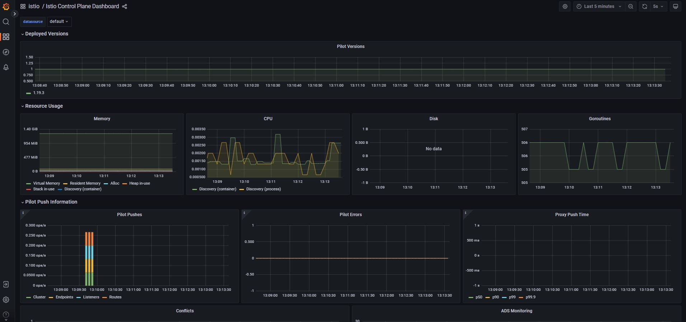

# Deployment of the SDXL model on AWS using Kserve

Provide the text sentence as an input to the model and it will generate the artificial images.


## 1. AWS Setup 
 - Spin up the EKS cluster on AWS, Create eks-config.yaml file. Run command:
    ```
    eksctl create cluster -f eks-config.yaml
    ```
 - Enable OIDC for your cluster: 
    ```
    eksctl utils associate-iam-oidc-provider --region ap-south-1 --cluster basic-cluster --approve
    ```
 - Create the IRSA for EBS on EKS
    ```
    eksctl create iamserviceaccount \  
    --name ebs-csi-controller-sa \  
    --namespace kube-system \  
    --cluster basic-cluster \  
    --role-name AmazonEKS_EBS_CSI_DriverRole \  
    --role-only \  
    --attach-policy-arn arn:aws:iam::aws:policy/service-role/AmazonEBSCSIDriverPolicy \  
    --approve \  
    --region ap-south-1
    ```
 - Create the EBS CSI Driver Addon
    ```
    eksctl create addon --name aws-ebs-csi-driver --cluster basic-cluster --service-account-role-arn arn:aws:iam::<YOUR_ACCOUNT_ID>:role/AmazonEKS_EBS_CSI_DriverRole --region ap-south-1 --force
    ```
 - (Optional) If an instance added later-on to eks configuration.
    ```
    `eksctl create nodegroup --config-file=eks-config.yaml`
    ```

## 2. Istio Installation on EKS Cluster
 - Install instio using helm and create the namespace
    ```
    helm repo add istio https://istio-release.storage.googleapis.com/charts

    kubectl create namespace istio-system

    helm install istio-base istio/base -n istio-system --set defaultRevision=default

    helm install istiod istio/istiod -n istio-system --wait

    kubectl create namespace istio-ingress
    ```

 - Install istio ingress gateway:
    ```
    helm install istio-ingress istio/gateway -n istio-ingress \
        --set "labels.istio=ingressgateway" \
        --set service.annotations."service\.beta\.kubernetes\.io/aws-load-balancer-type"="nlb" \
        --set service.annotations."service\.beta\.kubernetes\.io/aws-load-balancer-scheme"="internet-facing" \
        --set service.annotations."service\.beta\.kubernetes\.io/aws-load-balancer-attributes"="load_balancing.cross_zone.enabled=true" \
        --wait
    ```
## 3.Install Addons:
 -  Metric servers addons
    ```
    kubectl apply -f https://github.com/kubernetes-sigs/metrics-server/releases/latest/download/components.yaml

    ```
 -  ADDONS for kiali jaeger prometheus grafana
    ```
    for ADDON in kiali jaeger prometheus grafana
    do
        ADDON_URL="https://raw.githubusercontent.com/istio/istio/release-1.18/samples/addons/$ADDON.yaml"
        kubectl apply -f $ADDON_URL
    done
    ```
 -  Enable SideCar Injection:
    ```
    kubectl label namespace default istio-injection=enabled
    ```
 -  Install the Gateway CRDs:
    ```
    kubectl get crd gateways.gateway.networking.k8s.io &> /dev/null || { kubectl kustomize "github.com/kubernetes-sigs/gateway-api/config/crd?ref=v0.8.0" | kubectl apply -f -; }
    ```

## 4. (Optional) Test if istio is working

 -  We can hit the bookinfo endpoint: 
    ```
    k apply -f https://raw.githubusercontent.com/istio/istio/release-1.19/samples/bookinfo/platform/kube/bookinfo.yaml

    kubectl exec "$(kubectl get pod -l app=ratings -o jsonpath='{.items[0].metadata.name}')" -c ratings -- curl -sS productpage:9080/productpage | grep -o "<title>.*</title>"

    k apply -f https://raw.githubusercontent.com/istio/istio/release-1.19/samples/bookinfo/gateway-api/bookinfo-gateway.yaml

    export INGRESS_HOST=$(kubectl get gtw bookinfo-gateway -o jsonpath='{.status.addresses[0].value}')
    export INGRESS_PORT=$(kubectl get gtw bookinfo-gateway -o jsonpath='{.spec.listeners[?(@.name=="http")].port}')
    export GATEWAY_URL=$INGRESS_HOST:$INGRESS_PORT

    echo $GATEWAY_URL ## --> this should give url, if empty then check istio
    ```

## 5. Install KServe

 -  Create `istio-kserve-ingress.yaml` file and run command:
    ``` 
    k apply -f istio-kserve-ingress.yaml
    ```
 -  Install Cert Manager
    ```
    kubectl apply -f https://github.com/cert-manager/cert-manager/releases/download/v1.13.1/cert-manager.yaml
    ```
 -  Install KServe Manifest
    ```
    kubectl apply -f https://github.com/kserve/kserve/releases/download/v0.11.0/kserve.yaml
    ```
 -  Install KServe Runtime
    ```
    kubectl apply -f https://github.com/kserve/kserve/releases/download/v0.11.0/kserve-runtimes.yaml
    ```
 -  Do patching by running: 
    ``` 
    kubectl patch configmap/inferenceservice-config -n kserve --type=strategic -p '{"data": {"deploy": "{\"defaultDeploymentMode\": \"RawDeployment\"}"}}'
    ```

## 6. Create S3 bucket for KServe
-  Create a S3 Bucket on aws where we will store these model .mar files, which will be loaded by KServe: **emlo-sess19**.

- Create IRSA for S3 Read Only Access:
```
eksctl create iamserviceaccount --cluster=basic-cluster --name=s3-read-only --attach-policy-arn=arn:aws:iam::aws:policy/AmazonS3ReadOnlyAccess --override-existing-serviceaccounts --region ap-south-1 --approve
```
- Create S3 Secret file to be used by our Inference Service: **s3-secret.yaml**

- Run command: `k apply -f s3-secret.yaml`

- Attach the secret: `k patch serviceaccount s3-read-only -p '{"secrets": [{"name": "s3-secret"}]}'`

## 7. Preparation to deploy SDXL on EKS with KServe

 -  Create a folder `config` and inside it create `config.properties` file.
 -  Create `requirement.txt`.
 -  Create `sdxl_handler.py` script.
 -  Now, start a torchserve docker container to create the model archive file:
    ```
    `docker run -it --rm --shm-size=1g --ulimit memlock=-1 --ulimit stack=67108864 --gpus all --env NVIDIA_DISABLE_REQUIRE=1 -v ${PWD}:/opt/src pytorch/torchserve:0.8.1-gpu bash`
    ```    
 -  Create MAR from handler and model artifact:  
    > `cd /opt/src`

    > `torch-model-archiver --model-name sdxl --version 1.0 --handler sdxl_handler.py --extra-files sdxl-1.0-model.zip -r requirements.txt`

 -  upload config.properties and .mar file to s3 bucket.
    ```
    aws s3 cp config.properties s3://emlo-sess19/config/
    aws s3 cp sdxl.mar s3://emlo-sess19/model-store/
    ```
 -  Create `sdxl.yaml` file.

 -  Run to deploy sdxl: `k apply -f sdxl.yaml`

## 8. Monitoring the Deployment

> k get ds -n kube-system

> kubectl -n kube-system delete daemonset nvidia-device-plugin-daemonset

> kubectl create namespace gpu-operator

> curl https://raw.githubusercontent.com/NVIDIA/dcgm-exporter/main/etc/dcp-metrics-included.csv > dcgm-metrics.csv

> kubectl create configmap metrics-config -n gpu-operator --from-file=dcgm-metrics.csv

> helm repo add nvidia https://helm.ngc.nvidia.com/nvidia

> helm install --wait --generate-name -n gpu-operator --create-namespace nvidia/gpu-operator --set "dcgmExporter.config.name"=metrics-config --set "dcgmExporter.env[0].name"=DCGM_EXPORTER_COLLECTORS --set "dcgmExporter.env[0].value"=/etc/dcgm-exporter/dcgm-metrics.csv --set toolkit.enabled=false

> kubectl -n gpu-operator logs -f $(kubectl -n gpu-operator get pods | grep dcgm | cut -d ' ' -f 1 | head -n 1)

- Create `prometheus.yaml` file.
- Run: `k apply -f prometheus.yaml`.
- View metrics:

    a. Prometheus : `kubectl port-forward svc/prometheus 9090:9090 -n istio-system`.

    b. Grafana : `kubectl port-forward svc/grafana 3000:3000 -n istio-system`.

    c. Kiali : `kubectl port-forward svc/kiali 20001:20001 -n istio-system`.

## 9. Test SDXL Model:

- Get Ingress host and port:
```
export INGRESS_HOST=$(kubectl -n istio-ingress get service istio-ingress -o jsonpath='{.status.loadBalancer.ingress[0].hostname}')
export INGRESS_PORT=$(kubectl -n istio-ingress get service istio-ingress -o jsonpath='{.spec.ports[?(@.name=="http2")].port}')
```
```
MODEL_NAME=sdxl
SERVICE_HOSTNAME=$(kubectl get inferenceservice torchserve -o jsonpath='{.status.url}' | cut -d "/" -f 3)
```
```
echo http://${INGRESS_HOST}:${INGRESS_PORT}/v1/models/${MODEL_NAME}:predict
```
- Take the url from above output and copy+paste it in the test_kserve.py file.
- Run "Python test_kserve.py"

## 10. Output Images


## 11. Results Monitering
```
kubectl get pods
```


```
kubectl get all -A
```
- Deplyoment file [KGALL _File](Images/kgall.txt)

- Logs of your torchserve-predictor
[torchserve-predictor](Images/logs_torchserve.txt)

- Kiali


- Grafana



- Promethus


## Group Members
- Aman Jaipuria
- Anurag Mittal
